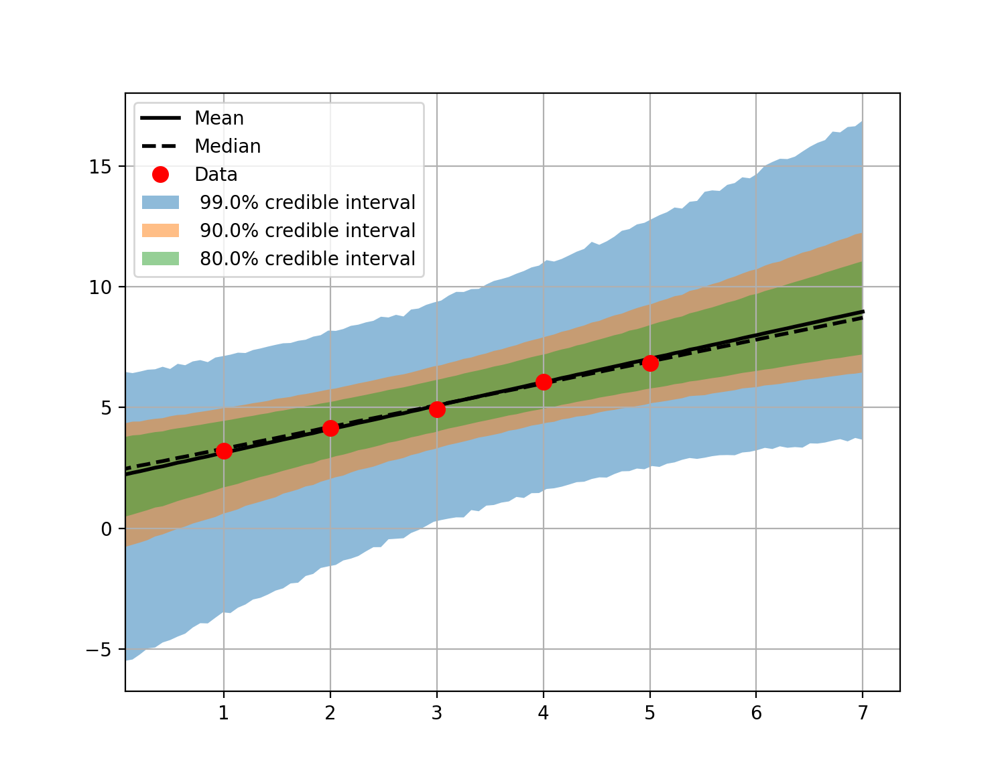

Model Propagation
==========================================

In this tutorial we show how to pass multiple input sets through a computational model (this setup may be used to do uncertainty propagation and distribute the workload).

Problem Description
---------------------------

We are given a set of parameters to evaluate in a file 'samplesOut.dat'.
We want to execute a model function :math:`f(\theta)` on given parameters.

Propagate Model Evaluations
---------------------------

The Korali Object
---------------------------
Initialize a korali object

.. code-block:: python

 e = korali.Experiment()

The Problem Type
---------------------------
The type of problem is `Execution/Model`.

.. code-block:: python

 e["Problem"]["Type"] = "Execution/Model"

The Variables
---------------------------

In the file we have means and variances to evaluate:

.. code-block:: python

 e["Variables"][0]["Name"] = "Mean"
  e["Variables"][0]["Loaded Values"] = means
  e["Variables"][1]["Name"] = "Variance"
  e["Variables"][1]["Loaded Values"] = variances

The Solver
---------------------------
We set the solver and choose how many samples are evaluated per generation.

.. code-block:: python

 e["Solver"]["Type"] = "Executor"
  e["Solver"]["Executions Per Generation"] = 1

Running
---------------------------
We are now ready to run our example: `./run-execution.py`

The results are saved in the folder `_korali_result/`.

Propagation of Uncertainty
==========================================
In this tutorial we sample the posterior of a linear problem, as in the
:ref:`Bayesian inference examples <examples-bayesian-inference-reference>`.
Then we evaluate the linear model for all the parameters that are in the sample
database and different input values. We use these model evaluations to compute
the uncertainty in the predictions by plotting credible intervals.

The first part is identical to the
:ref:`Bayesian inference example <examples-bayesian-inference-reference>`.

For the second part, first we define a new input variable

.. code-block:: python

  x = np.linspace(0,7,100)

These are the new points on which we are going to evaluate the linear model on
all the samples from the previous step. We define a new function for the
propagation that is similar to the one we used for the sampling phase

.. code-block:: python

 def model_propagation(s, X):

  a = s['Parameters'][0]
  b = s['Parameters'][1]

  s['sigma'] = s['Parameters'][2]
  s['X'] = X.tolist()
  s['Evaluations'] = []
  for x in X:
    s['Evaluations'] += [a * x + b]

The fields :code:`'sigma'`, :code:`'X'` and :code:`'Evaluations'` are going to be saved
for each sample under :code:`['Samples'][k]`. In order for these variable
to be saved we have to set

.. code-block:: python

  e['Store Sample Information'] = True

Next, we load the json file with the results from the sampling

.. code-block:: python

  with open('_korali_result_samples/latest') as f: d=json.load(f)

Then we copy the samples to the Korali variables

.. code-block:: python

 e['Variables'][0]['Name'] = 'a'
  e['Variables'][0]['Precomputed Values'] = [ x[0] for x in d['Results']['Sample Database'] ]
  e['Variables'][1]['Name'] = 'b'
  e['Variables'][1]['Precomputed Values'] = [ x[1] for x in d['Results']['Sample Database'] ]
  e['Variables'][2]['Name'] = 'sigma'
  e['Variables'][2]['Precomputed Values'] = [ x[2] for x in d['Results']['Sample Database'] ]

Note that the samples are saved under :code:`d['Results']['Sample Database']`.

Finally, we can compute the credible intervals and plot the results.

